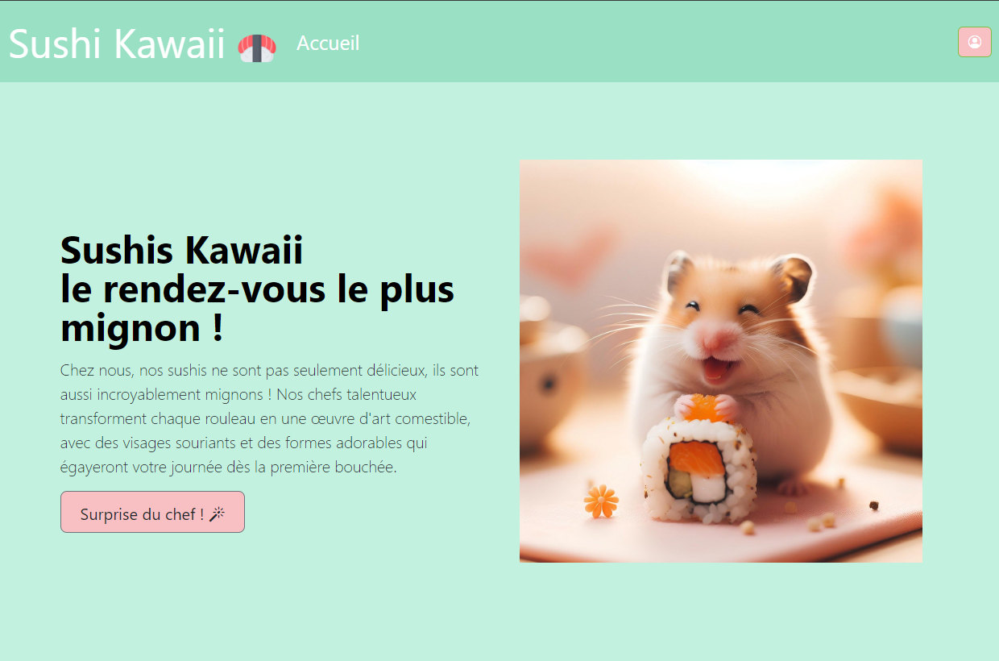

# Bienvenue sur le site vitrine "Nom du Site" !

Ce site vitrine est un projet fictif et humoristique créé pour présenter [Emilie Clain], un endroit où l'humour rencontre la créativité pour offrir une expérience unique en ligne.

## Aperçu du Site



## Technologies Utilisées

Ce site vitrine a été développé en utilisant les technologies suivantes :

- HTML
- CSS

## Fonctionnalités

- [Site à des fin publicitaire-visite virtuelle offrant aux clients une expérience imersive]

## Installation et Utilisation

1. Cloner ce dépôt sur votre machine locale :

```
git clone https://github.com/votrenomutilisateur/nom-du-projet.git
```

2. Ouvrir le fichier `index.html` dans votre navigateur web pour accéder au site.

## Contributions

Les contributions sont les bienvenues ! Si vous avez des idées d'amélioration ou si vous souhaitez résoudre des problèmes, n'hésitez pas à ouvrir une issue ou à soumettre une pull request.

## Auteur

Ce projet a été créé par [Emilie Clain].

## Licence

Ce projet est sous licence MIT. Consultez le fichier `LICENSE.md` pour plus d'informations.

---

[Insérer d'autres informations pertinentes ou des liens vers des ressources externes ici]
